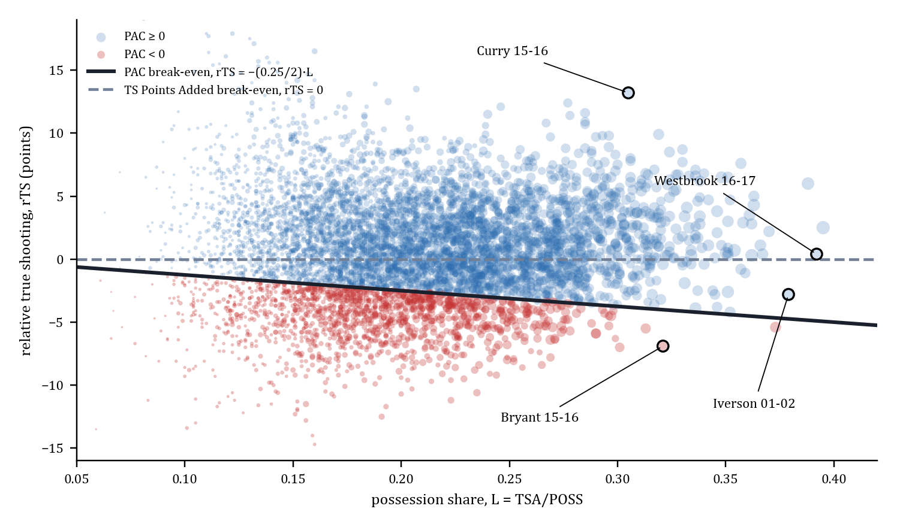
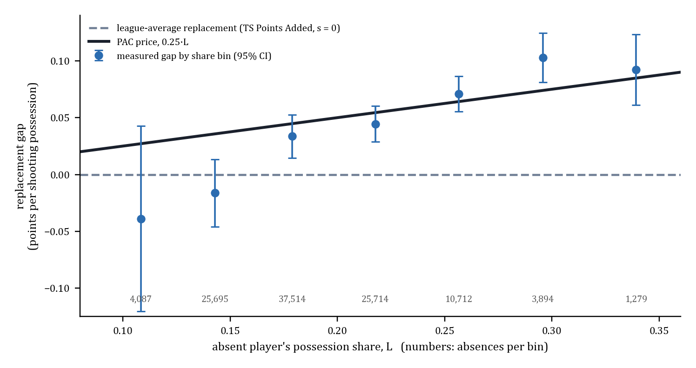

# PAC — Estimating the Opportunity Cost of Shooting Volume

**What a possession returns when somebody else takes it, measured instead of assumed.**

Working paper v1 (October 1, 2026; abstract, full paper in progress):
[court-share.com/luma/papers/opportunity-cost-of-shooting-volume](https://court-share.com/luma/papers/opportunity-cost-of-shooting-volume)
· PDF: [paper/PAC_working_paper_v1.pdf](paper/PAC_working_paper_v1.pdf)

Every load-adjusted scoring statistic in basketball values an attempt against league-average
efficiency. TS Points Added, relative true shooting, points above average: each one asserts that if
a replacement had taken the shot, it would have returned the league rate. That is a price, set at
`s = 0` and never measured. This repository measures it.

```
s = 0.257   95% CI [0.223, 0.291]    game-level design, 68,708 team-games, 108,895 rotation-player absences
s = 0.245   95% CI [0.204, 0.284]    held-out design, 739 player-seasons, 10,676 games missed
s = 0.25                             the price PAC uses (inside both intervals)
```

For every 10 percentage points of his team's offense a player carries, the shots that replace him
come back about 2.5 points per 100 worse than league average.

Author: Ayomide Awoyemi, LUMA Basketball Research (court-share.com/luma).
Data: public NBA play-by-play and box scores, every regular season 1997-98 through 2025-26.
No tracking data.

---

## The formula

```
L        = TSA / POSS                   season share of on-court possessions
TSA      = FGA + 0.44 * FTA             shooting possessions consumed
price(L) = 2*TS_league - s*L            what a redistributed possession returns
PAC      = TS Points Added + s * TSA^2 / POSS      Points Above Cost, s = 0.25
```

Break-even falls out by setting PAC to zero:

```
rTS = -(s/2) * L
```

At s = 0.25 that is **-3.8 rTS at 30% share and -5.0 at 40%**, against 0 for TS Points Added. A
player carrying a third of his team's offense breaks even while shooting below league average,
because the shots that replace him are worse.

`L` is the **season** share, never the night's share. The price is a property of the player's
role; the quantity is per game. Pricing per night breaks the identity that per-game values sum to
season values.

A rotation player, throughout, is one with 10+ appearances and 4+ TSA per appearance.

---

## What the estimand is, and what it is not

This is **not** the usage-efficiency skill curve. That asks what happens to *his* efficiency when
he carries more load. Oliver, Witus, and the usage-versus-efficiency literature answer that
question.

This is **not** the optimal-stopping question either. That asks what a possession is worth if he
passes and the clock keeps running. Goldman and Rao, Skinner, and Sandholtz answer that one.

This asks a third thing: **he is absent for the game. What does the team recover on the
possessions his teammates must now absorb, as a function of how much he was carrying?** The
population being measured is the teammates, not the star.

---

## The evidence

**Primary design.** Team points per shooting possession in every team-game, 1997-98 to 2025-26
(68,708 team-games), regressed on every rotation player's absence jointly (108,895 absences), after
accounting for each absent player's own points and attempts. Roster-spell, opponent-season and
season-month fixed effects; home, rest and opponent-absence controls; standard errors clustered by
team-season (863 clusters; the cluster bootstrap agrees).

**s = 0.257 [0.223, 0.291].**

**Second, held-out design.** Predict team efficiency in the 10,676 games missed by 739 high-usage
player-seasons, using only teammates' on-court rates, and score each candidate price against what
happened. **s = 0.245 [0.204, 0.284].** Different design, different sample, same answer.

| check | result |
|---|---|
| placebo: absences reassigned at random within each player's team tenure, 500 draws | gap at 30% share **0.098** vs placebo 95% range **[-0.011, 0.012]**, p = 0.002 |
| 11 alternative specifications (FT weight 0.40 / 0.475, per possession used, team-month FE, drop last 15 games, drop COVID seasons, drop 10+ game absences, stricter / looser rotation filters, unweighted, franchise clusters) | s in **[0.217, 0.276]** |
| leave-one-season-out prediction of absence games | share-dependent price beats league-average replacement in **26 of 29** held-out seasons |
| pre-trend: he played, 2 games before an absence run | 0.009 [-0.010, 0.027], no effect |
| absence game 1 / games 2-3 / games 4+ | 0.093 / 0.121 / 0.090: no decay, no sign of teams adapting it away |
| low-assist scorers vs high-assist playmakers, gap at 30% share | **0.072** vs **0.106**; PAC's implied 0.075. PAC prices the scarcity; the playmakers' extra is creation value PAC does not price |

### Table 1. Points per game a team loses when a player sits, against what each statistic says he is worth

| absent player's share | absences | actually lost | TS Added says | PAC (s = 0.25) says |
|---|---|---|---|---|
| under 15% | 20,669 | -0.39 [-0.59, -0.19] | -0.08 | 0.10 |
| 15-20% | 46,627 | -0.12 [-0.28, 0.03] | -0.21 | 0.10 |
| 20-25% | 29,319 | 0.32 [0.13, 0.51] | -0.25 | 0.33 |
| 25-30% | 9,543 | 2.00 [1.68, 2.32] | 0.07 | 1.14 |
| **30% and up** | **2,737** | **3.52 [2.92, 4.12]** | **0.52** | **2.30** |

Actually lost: change in team points per game per absent player in each share bin, same fixed
effects and controls as the primary design (95% CI clustered by team-season). TS Points Added and
PAC: the absent players' per-game values.



**Figure 1.** Shooting-efficiency break-even by possession share, every qualified player-season 1997-98 to
2025-26 (n = 6,315). Seasons above the solid line have positive PAC at s = 0.25; TS Points Added places
every break-even at the dashed line.



**Figure 2.** What a player's shooting possessions return when he sits, relative to league average, by his
possession share (non-parametric share bins, 95% CI clustered by team-season), against PAC's price 0.25·L
and league-average replacement (TS Points Added, s = 0).

Validation panels (free-intercept fit, event time around an absence run, the 500-draw placebo):
[results/price_schedule.png](results/price_schedule.png).

Full results: [docs/PAC_VALIDATED_NUMBERS.md](docs/PAC_VALIDATED_NUMBERS.md),
[results/gamelevel.md](results/gamelevel.md),
[docs/PAC_RECONCILIATION.md](docs/PAC_RECONCILIATION.md) (old record vs new).

---

## Reproduce

```bash
git clone https://github.com/aayoawoyemi/pac && cd pac
pip install -r requirements.txt          # Python 3.12
python scripts/run_all.py                # ~20 min; ends by checking every number in the paper
```

`python scripts/run_all.py --fast` is a two-minute smoke test (20 placebo and bootstrap draws instead of 500 and 200).
`python scripts/check_abstract_numbers.py` alone re-checks the committed results against the paper.

Everything the analysis reads is in [data/](data/README.md) (17 MB): the team-game panel, PAC per player-season, the
schedules and the held-out carriers. The raw play-by-play (3.7 GB) and lineup stints (352 MB) are not redistributed;
only the build scripts 00-03 need them, and [data/README.md](data/README.md) says how to obtain them.

| script | does | needs |
|---|---|---|
| `00_fetch_schedules.py` | ESPN game dates, for rest controls | internet |
| `01_build_player_values.py` | per-game and per-season PAC inputs at s = 0.25; also computes PAC for any season | raw play-by-play |
| `02_build_team_games.py` | the team-game panel | raw play-by-play |
| `03_build_heldout_carriers.py` | the held-out design's 739 carrier-seasons | raw lineup stints |
| `10_estimate_price.py` | primary design: s, placebo, bootstrap, 11 alternative specs, leave-one-season-out, event study | `data/` |
| `11_heldout_design.py` | held-out design | `data/` |
| `12_pac_vs_tsadd.py` | Table 1 | `data/`, `results/gamelevel.json` |
| `13_cases.py` | Iverson, scoring champions, MVPs, named players | `data/` |
| `14_scarcity.py` | low-assist scorers vs playmakers | `data/` |
| `15_known_answer.py` | known-answer simulation, hidden-confounder sensitivity | `data/` |
| `16_team_price.py` | per-team prices (not detectable) | `data/` |
| `17_mechanism.py` | who shoots vs how well they shoot | `data/` |
| `19_figures.py` | Figures 1 and 2 (pixel-identical to `paper/figures/`) | `data/`, `results/gamelevel.json` |

### Every number in the paper, and where it comes from

| paper | value | script | output |
|---|---|---|---|
| s, primary design | 0.257 [0.223, 0.291] | 10 | `results/gamelevel.json` `main.s_origin`, `s_origin_se` |
| team-games, rotation-player absences | 68,708; 108,895 | 10 | `descriptives` |
| s, held-out design | 0.245 [0.204, 0.284]; 739 player-seasons, 10,676 games | 11 | `results/heldout.md`, row `pooled` |
| break-even at 30% / 40% share | -3.8 / -5.0 rTS | formula | rTS = -(0.25/2)·L |
| placebo at 30% share | 0.098 vs [-0.011, 0.012], p = 0.002, 500 draws | 10 | `permutation.gap30` |
| 11 alternative specifications | s in [0.217, 0.276] | 10 | `robustness[1:]` (`[0]` is the main spec) |
| low-assist / PAC / playmakers at 30% | 0.072 / 0.075 / 0.106 | 14 | `results/scarcity.md` |
| Table 1, incl. 3.52 / 0.52 / 2.30 at 30%+ | | 12 | `results/pac_vs_tsadd.md` section 1 |
| Iverson 2001-02 | TS Added -1.78/g (214th of 216), PAC +1.23 (60th) | 13 | `results/cases.md` |
| Figure 1 pool | 6,315 player-seasons | 13, 19 | `results/cases.md` |

The held-out input `data/heldout/carriers.json` is the 2026-09-21 build that the paper's numbers come from. After the
lineup stints were rebuilt on 2026-09-26, the same 739 player-seasons give 0.244 [0.203, 0.282] (see
[data/README.md](data/README.md)).

```
pac/        library code (paths, primary design, held-out design, PAC builder)
scripts/    numbered entry points, run_all.py, check_abstract_numbers.py
data/       inputs, with schemas in data/README.md
results/    everything the scripts regenerate
paper/      working paper PDF and figures
archive/    retired designs, kept for the record (archive/README.md)
docs/       PAC_VALIDATED_NUMBERS.md (full validated record), PAC_RECONCILIATION.md (old record vs new)
```

---

## What the price does to the leaderboard

Per-game values, ranked within season. Pool: 6,315 qualified player-seasons (40+ games, 2,500+
possessions). Source: [results/cases.md](results/cases.md).

| player-season | PPG rank | TS Added/g (rank) | PAC/g (rank) | of |
|---|---|---|---|---|
| Allen Iverson 2001-02 | 1 | -1.78 (**214**) | +1.23 (**60**) | 216 |
| Russell Westbrook 2016-17 | 1 | +0.24 (92) | +3.01 (15) | 240 |
| DeMar DeRozan 2016-17 | 5 | +0.07 (107) | +2.19 (28) | 240 |
| Jaylen Brown 2025-26 | 4 | -0.41 (168) | +1.82 (33) | 236 |

DeRozan's nine Toronto seasons (2009-10 to 2017-18): **TS Added -132 points, PAC +731.** Same box
scores.

Four of 218 player-seasons at 30%+ share fall below break-even: Michael Jordan 2001-02, Tracy
McGrady 2007-08, Kobe Bryant 2015-16, John Wall 2020-21.

**The coefficient was never chosen by validation against an impact target.** Sweeping `s` against
impact rewards load monotonically and would have produced a larger number. Measure on outcomes,
then validate, in that order.

---

## Limitations, stated plainly

1. **Linear through zero is not the best-fitting shape.** With a free intercept the total absence
   cost is c = -0.077 [-0.113, -0.041] + 0.564·L, and a hinge at about 13% share fits best. So
   0.25·L over-charges the 15-25% range. PAC keeps the one-parameter form for v1; the full paper
   reports the alternatives.
2. **Absences are not randomized.** Defenses: roster-spell and opponent fixed effects, rest
   controls, the event study (no pre-trend, no decay), the placebo, injury-only runs, team-month
   fixed effects.
3. **One league-wide price**, not roster-specific. Team-specific prices were tested and are not
   detectable.
4. **`FGA + 0.44*FTA` is an approximation**, not rebuilt from play-by-play shot episodes. FT
   weights 0.40-0.475 move the 30% gap by at most 0.003.
5. **Gross points per shooting possession.** Per possession used (turnovers included), the gap at
   30% share is 0.083.
6. Game dates for 1997-2020 are matched from ESPN schedules (99.9% exact in a 2022-23 check); they
   feed only the rest controls. 2025-26 on-court coverage is 81% of games.
7. **PAC is a scoring column, not a value metric.** No defense, no passing, no gravity. Jaylen
   Brown won 2024 Finals MVP while ranking third on his own team in PAC.

---

## Retired from earlier versions of this repository

An earlier README headlined s = 0.245 alone, backed by designs that no longer stand: an in-game
rest design (0.324, contaminated by bench-unit lineups), a teammate-absence instrument (-0.30, no
script, and it measures his own skill curve rather than the price), a next-season design (0.27,
uninformative), a "per-carrier correlation of 0.346 that no confounder produces" (the logic does not
hold), a U-shaped held-out MSE curve offered as proof (a quadratic loss is always U-shaped), the
old placebos (0.004 / -0.066, replaced by the 500-draw permutation placebo), and an implied-price
table for other statistics. None of these should be cited. The 0.245 held-out estimate stands, as
the second design.

---

## A retraction, kept public on purpose

An earlier version of this work reported **s = 0.42**, computed in a notebook and never saved as a
script. On re-verification it could not be reproduced by any design: three rebuilds, an
independent reimplementation, and a held-out calibration. It sits outside every interval above.
Likely causes were absences counted outside the player's tenure window, and share measured against
team attempts rather than on-court possessions, roughly a 1.4x unit mismatch.

**Do not reuse 0.42.**

The rule that came out of it, and that governs this repository: any coefficient that reaches a
leaderboard needs a script that regenerates it from raw files, a placebo, a held-out prediction,
and an independent reimplementation by someone given the data and the question but not the
number. Notebook results are provisional until the script exists.

---

## Citation

```
Awoyemi, A. (2026). Estimating the Opportunity Cost of Shooting Volume. Working paper v1,
LUMA Basketball Research. https://court-share.com/luma/papers/opportunity-cost-of-shooting-volume
Code and data: https://github.com/aayoawoyemi/pac
```

## License

Code MIT. Derived results free to use with attribution.
